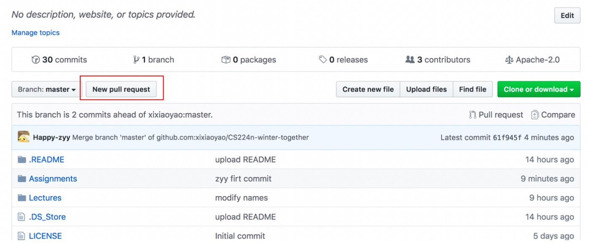

## [CS224N-winter-together](https://github.com/xixiaoyao/CS224n.2020)

`CS224n-winter-together`（又叫`Stanford CS224n追剧计划`）是由微信公众号 [夕小瑶的卖萌屋](https://mp.weixin.qq.com/s?__biz=MzIwNzc2NTk0NQ==&mid=2247485633&idx=1&sn=24f65254ae07f53ebb1d976b37d2573b&chksm=970c2017a07ba90182d85fc0a238d3234bd9fe3eb357371db756ba73e321f733d52658fe941b&token=1203749132&lang=zh_CN#rd) 发起的开源课程学习项目，**本项目旨在为大家提供一个课程笔记、感悟与延伸、课程作业与project的分享与内容沉淀平台**，每个人均可将自己的笔记、感悟、作业等提交到该repo下面对应课程的文件夹底下，来方便大家参考学习，具体细节见[提交流程](https://github.com/xixiaoyao/CS224n-winter-together/blob/master/README.md#%E4%B8%AA%E4%BA%BA%E7%AC%94%E8%AE%B0%E6%84%9F%E6%82%9F%E5%92%8C%E4%BD%9C%E4%B8%9A%E6%8F%90%E4%BA%A4%E6%B5%81%E7%A8%8B)。另外，鼓励大家以markdown格式进行提交以免repo大小增长过快。

本项目在2020年斯坦福大学开设的自然语言处理课程CS224n的基础上建立，注意，由于2020年的视频现在没有对外放出，因此视频资料是2019年的（不过连线斯坦福的小伙伴问了一下，区别不大，PPT也更新不大），其他资料均为今年的。

> Stanford CS224n官方课程主页：http://web.stanford.edu/class/cs224n

关于该计划的详细攻略见 [这里](https://mp.weixin.qq.com/s?__biz=MzIwNzc2NTk0NQ==&mid=2247485633&idx=1&sn=24f65254ae07f53ebb1d976b37d2573b&chksm=970c2017a07ba90182d85fc0a238d3234bd9fe3eb357371db756ba73e321f733d52658fe941b&token=1203749132&lang=zh_CN#rd)


### 项目目录

```text
.
├── Lectures（课程资料）
│   ├── Class 1. Introduction and Word Vectors
|   |    ├── video（教学视频，配中英双语字幕） 
│   │    ├── slides (课件）
│   │    ├── additional readings（推荐阅读）
│   │    ├── FAQ（问题总结，整理自微信讨论群）
│   │    └── notes（官方笔记）
│   ├── Class ...
│   └── Class N 
│
├─── Assignments（课程作业）
│    ├─- Assignment 1
│    │   └── upload（大家在该目录上传自己完成的作业）
│    ├─- Assignment ...
│    └── Assignment N 
│
├─── Feature Notes（第三方笔记、感悟和延伸文章）
│    └── upload（大家在该目录上传自己完成的笔记、感悟和延伸文章，请务必保证原创）
│
└─── Projects（项目实战）
     └── upload（大家在该目录上传自己队伍完成的实战项目，目前暂未开放）
```

### 课程计划

微信公众号**夕小瑶的卖萌屋**将每周推送两集课程视频（中英双语字幕）和对应的官方ppt/笔记/推荐阅读材料等，并发布课后作业。

- week1：Introduction and Word Vectors
- week2：Word Vectors 2 and Word Senses / Word Window Classification and Neural Networks
- week3：Matrix Calculus and Backpropagation / Linguistic Structure: Dependency Parsing
- week4：The probability of a sentence? Recurrent Neural Networks and Language Models / Vanishing Gradients and Fancy RNNs
- week5：Machine Translation, Seq2Seq and Attention / Practical Tips for Final Projects
- week6：Question Answering and the Default Final Project/ConvNets for NLP
- week7：Information from parts of words (Subword Models) and Transformer architectures / Contextual Word Representations: BERT
- week8：Modeling contexts of use: Contextual Representations and Pretraining / Natural Language Generation
- week9：Reference in Language and Coreference Resolution / Fairness and Inclusion in AI
- week10：Constituency Parsing and Tree Recursive Neural Networks / Recent Advances in Low Resource Machine Translation
- week11：Future of NLP + Deep Learning

### 个人笔记、感悟和作业提交流程

请务必保证原创！若发现其他同学的笔记、作业等提交中有错误，鼓励提PR互相修复。另外，鼓励大家在上传的原创资料中留下联系方式，以便学习讨论和错误纠正。

**提交流程：**

*step 1.* fork项目

```shell
git clone https://github.com/xixiaoyao/CS224n-winter-together.git
```

*step 2*. 在自己的项目里提交笔记和作业到对应课程的指定文件夹。

cs224n的作业位于`/CS224n-winter-together/Assignments`目录下对应章节的压缩文件中，命名为homeworkX.zip。

```
unzip homework1.zip #解压缩作业
mv homework1 happy  #将作业进行改名,为了方便最后的提交不产生不必要的冲突,解压缩后改为自己的github名后，即可根据要求完成相应作业。
```

*step 3.* 本地仓库保存后，push至自己的github并创建 pull request (pr)。

```
git push -u origin master
```

<center></img></center>

关于作业提交的详细教程 [这里](https://blog.csdn.net/zyy617532750/article/details/104262005)


### 课前准备FAQ

1. 我想看往年的课件和讲义，去哪儿下载？

   答：http://web.stanford.edu/class/cs224n/

2. 现在的课程视频哪里有？

   答：目前公开的最新视频是2019年的，在[youtube](https://www.youtube.com/playlist?list=PLoROMvodv4rOhcuXMZkNm7j3fVwBBY42z)和[B站](https://www.bilibili.com/video/av55089927?from=search&seid=5422333259356167279)上都有。**推荐关注微信公众号『夕小瑶的卖萌屋』，我们会每周更新两节课，推送课件和字幕校对后的视频。**

3. 我在学习过程中有一些疑问，怎么办？

   答：建议首先在issues里面搜索相关问题，看看有没有帮助。仍然不能解决的，可以通过微信交流群（推荐）或github issue提出问题，我们会及时解答和归档。每节课归档后的问题集在对应的『问题』目录下面，供大家复习。

4. 有没有免费的GPU可以用来完成作业？

   答：我们推荐使用AiStudio、Colab和Kaggle Kernel。具体教程可以百度or谷歌一下。

---

   极力建议大家加入`夕小瑶@Stanford CS224n追剧群`与上千小伙伴一起打卡交流学习，通过微信交流群（推荐）或github issue提出的问题，我们将定期精选并在每期的订阅号文章推送和本github项目中沉淀。

<center></img></center>
